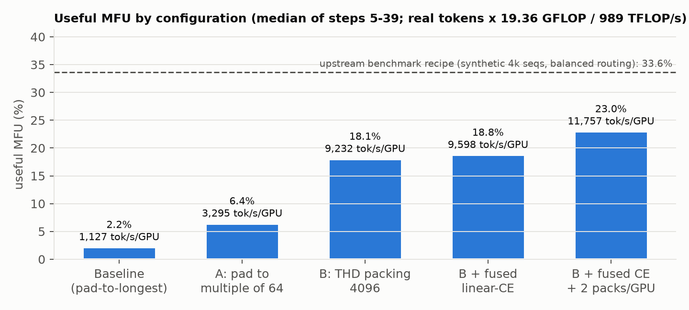
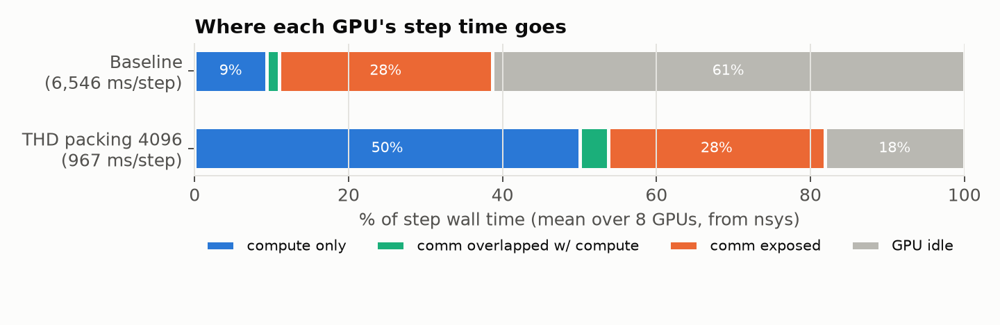
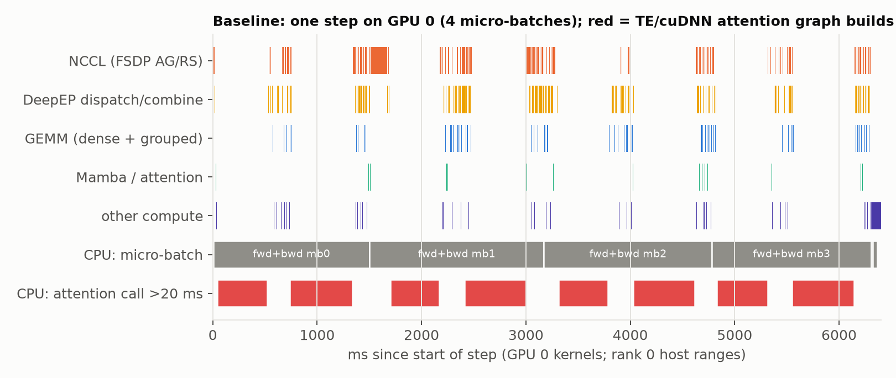
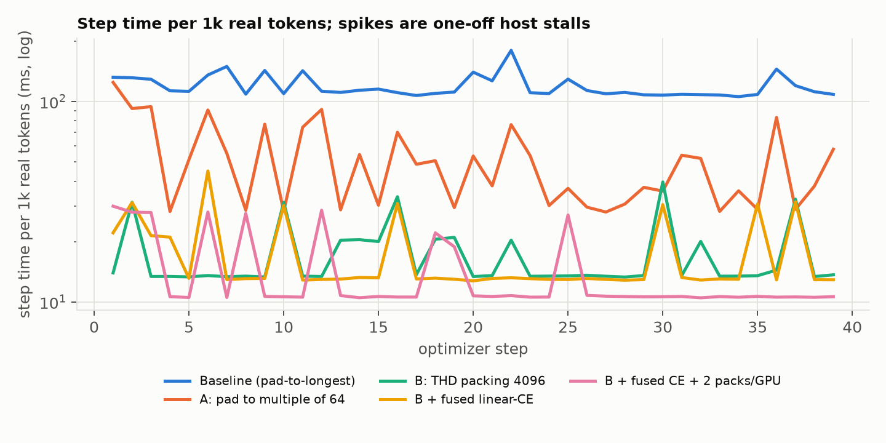
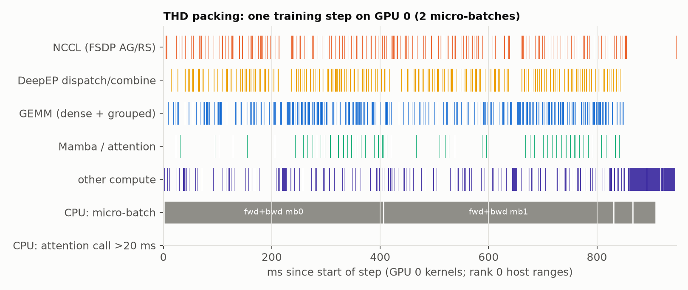
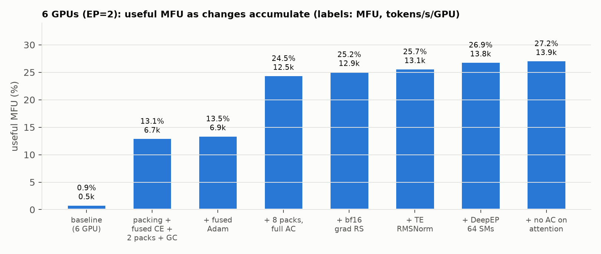
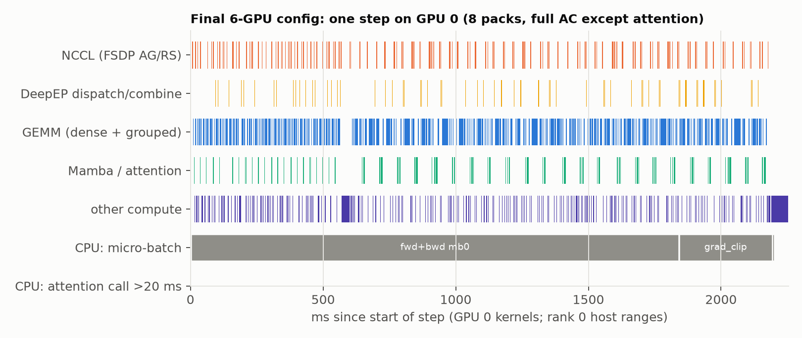
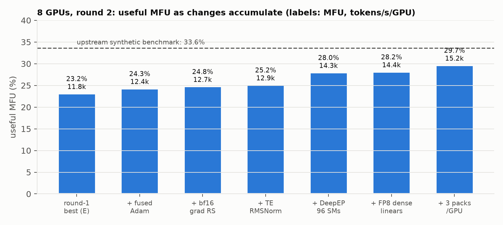
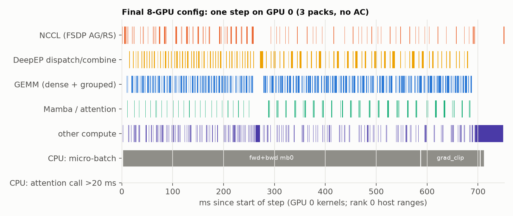

# Where the FLOPs go: Nemotron-3-Nano-30B-A3B full SFT on SQuAD in NeMo Automodel

*(8-GPU study: §1-6; 6-GPU optimisation loop: §6b; 8-GPU round 2: §6c; per-experiment logs: `results/experiments_6gpu.md`,
`results/experiments_8gpu_round2.md`.)*

EE 290/194 Scalable AI, Assignment 1 Part B. Stack: NeMo Automodel (`main` @ `8f73178`, fork branch
`mfu-study`), FSDP2 + expert parallelism (EP=8), 1 node × 8× H100 80GB SXM (NVLink), host driver R550.
All numbers are medians over steady-state steps (steps 5-39 of 40) unless noted. Raw data: `mfu/results/`.

**Headline.** The shipped recipe reaches **2.2% useful MFU (1,127 tokens/s/GPU)** on SQuAD. Profiling showed
the GPUs idle 61% of each step; the root cause was not compute or bandwidth but *host-side stalls*: TE's
cuDNN fused attention rebuilt its execution graph for almost every micro-batch because pad-to-longest
batching produces a new sequence length each time (~1 s of CPU per micro-batch, measured). Removing that
(fixed shapes via THD packing), then the padding waste, the materialised 131k-vocab logits, and gradient
accumulation raised throughput **10.5× to 11,836 tokens/s/GPU (23.2% useful MFU)** with an unchanged loss
curve. A second profile-driven loop on 6 GPUs (the node is shared; GPUs 0-1 left to groupmates), where expert
weights must also be FSDP-sharded, reached **14,326 tokens/s/GPU (28.0% useful MFU), 30× the 6-GPU baseline and 21%
more per GPU than the 8-GPU best**: larger micro-batches paid for by activation checkpointing (+81%), fused Adam,
bf16 gradient reduction, TE RMSNorm, a larger DeepEP SM budget and FP8 dense linears; the final step is GPU-bound (97.5% busy) with
GEMMs half of it. Re-testing those changes on all 8 GPUs (round 2) gave the final result, **15,172 tokens/s/GPU
(29.7% useful MFU; 15,347 / 30.0% over 100 steps), 13.5× the shipped recipe** and 90% of NVIDIA's synthetic-data
benchmark, while showing that the 6-GPU winner (bigger micro-batch + activation checkpointing) *loses* at EP=8,
where there is no per-micro-batch expert all-gather to amortise. Six framework fixes/features made this possible (uneven expert sharding, checkpoint loading, MoE
FSDP prefetch, partial activation checkpointing, shared-expert overlap, NVSHMEM-less DeepEP), all with unit tests.



---

## 1. Setup and exact reproduction

| | |
|---|---|
| Model | `nvidia/NVIDIA-Nemotron-3-Nano-30B-A3B-BF16`: 52 layers = 23 Mamba2 + 23 MoE (128 routed experts, top-6, + 1 shared; ReLU² MLPs) + 6 GQA attention (32 q / 2 kv heads); hidden 2688; vocab 131,072; 31.6B total / 3.2B active matmul params per token |
| Data | `rajpurkar/squad` train, Automodel `make_squad_dataset` (chat template, loss on answer tokens only) |
| Recipe | `train_ft` full-parameter SFT; config `mfu/configs/nemotron_nano_v3_squad_baseline.yaml` = shipped `examples/llm_finetune/nemotron/nemotron_nano_v3_hellaswag.yaml` with the dataset swapped to SQuAD (all deviations listed in the file header; none touch the training math) |
| Parallelism | FSDP2 over 8 ranks, EP=8 (16 experts/GPU), no TP/PP/CP, no activation checkpointing |
| Batch | global 256 samples, local 8 per GPU → 4 micro-batches of grad accumulation; Adam, lr 1e-5 |
| Kernels (backend defaults) | TE linear + TE/cuDNN fused attention, `torch._grouped_mm` experts, DeepEP intranode dispatcher, mamba-ssm Triton SSD kernels |
| Software | torch 2.10.0+cu128, TE 2.19.0, cuDNN 9.10.2, mamba-ssm 2.3.0, causal-conv1d 1.6.0, DeepEP @ `10d4dd7` (image `mfu/docker/Dockerfile.cu128`) |

Why a custom image: every published `nemo-automodel` container (25.11 → 26.08) is CUDA 13 and needs driver ≥ 580;
this host runs R550 (CUDA 12.4) and CUDA-13 forward compatibility does not exist on R550 (verified). The image keeps
every `uv.lock` version but uses the cu128 build of the locked torch and compiles TE / mamba / DeepEP against it.
Porting issues found and fixed on the way (each documented in the Dockerfile): CUDA-13-only wheels in the export,
DeepEP built without NVSHMEM (single node needs only intranode kernels), a driver-580 NVML/libcuda pulled in by
`libnvidia-ml-dev` that shadowed the host driver, and **two cuDNN versions loaded in one process** (system 9.8 for TE,
wheel 9.10 for torch) which segfaulted in `fused_attn_bwd`. One framework bug was fixed: `fused_a2a._is_nvshmem_available`
treated "SM90 compiled" as "NVSHMEM available" and crashed NVSHMEM-less DeepEP builds.

Reproduce (from `assignments/a01/p2`, see `mfu/README.md`):

```bash
docker build -f mfu/docker/Dockerfile.cu128 -t automodel-mfu:cu128 .
mfu/docker.sh -- python mfu/check_env.py                              # kernel smoke test
mfu/run.sh --name baseline                                            # 40 steps -> mfu/runs/<ts>_baseline/
mfu/run.sh --name baseline_nsys --profile nsys --steps 14 --nsys-steps 10:13
mfu/docker.sh -- python mfu/analyze_nsys.py mfu/runs/<ts>_baseline_nsys   # GPU time budget
python3 mfu/analyze_cpu.py mfu/runs/<ts>_baseline_nsys                    # host-side breakdown
python3 mfu/summarize.py mfu/runs/*                                       # comparison table
```

**Metric definitions.** *Useful MFU* = real (non-padding) tokens/s/GPU × 19.36 GFLOP/token ÷ 989 TFLOP/s (H100 SXM
dense BF16). 19.36 GFLOP/token = 6 × 3.227B active matmul params + attention scores at SQuAD lengths; it matches
Automodel's `flops_utils.nemotronh_flops` within 0.1% (checked). The recipe's own MFU column counts padded positions
(and, for packed rows, attention across the whole 4096-token row), so it overstates useful work; both are reported.

## 2. Baseline and what "current OSS best" looks like

| run | step (s) | tokens/s/GPU | recipe MFU | useful MFU | pad efficiency | peak mem |
|---|---|---|---|---|---|---|
| **Baseline** (shipped recipe on SQuAD) | 5.865 | 1,127 | 3.40% | **2.21%** | 0.643 | 60.1 GiB |
| Upstream benchmark recipe `llm_benchmark/nemotron/nemotron_nano_v3_te_deepep.yaml` (same image) | 15.56 | 16,844 | 33.6% | 33.6% | 1.00 | 63.9 GiB |

The upstream benchmark is the best configuration NVIDIA ships for this model, but it is not a like-for-like
workload: synthetic 4096-token sequences (no padding, fixed shape), `fake_balanced_gate` (perfectly balanced
expert load), activation checkpointing, and 2.1M tokens/step with 16-way gradient accumulation (optimizer and
gradient sync amortised over 32× more tokens than a SQuAD step). It is an upper bound for this node, not a target
the real-data recipe can match exactly.

## 3. Profiling results

nsys 2024.6 capture of steps 10-12 on all 8 ranks (`--trace cuda,nvtx`, capture window via `cudaProfilerStart/Stop`),
with per-module NVTX (Automodel `autonvtx`) plus added step-phase ranges. Profiling overhead: 6.4 s vs 5.9 s
unprofiled per step. Traces: `mfu/runs/*_baseline_nsys/profile.nsys-rep`, `mfu/runs/*_pack4096_nsys/profile.nsys-rep`.



**Baseline, per 6.5 s step (mean of 8 GPUs):**

| bucket | ms | % |
|---|---|---|
| GPU idle (no kernel on any stream) | 4,016 | **61.4%** |
| compute kernels (union) | 719 | 11.0% |
| communication kernels (union) | 1,917 | 29.3% |
| of which overlapped with compute | 106 | 1.6% |

Summed kernel time: NCCL reduce-scatter 787 ms, all-gather 765 ms (both `RING_LL`, i.e. small messages; the
reduce-scatter runs in fp32), DeepEP 624 ms, GEMM 341 ms, Mamba 75 ms, attention 3.5 ms. Only ~340 ms of a 6.5 s
step is matrix math.



The CPU side tells the story. CUDA API calls account for only ~0.8 s of host time per step, yet each micro-batch
takes **~1.5 s of host time to issue while the GPU needs ~0.7 s**, so the step is host-bound. Per-module NVTX shows
where: the 6 attention layers take **3.68 s of host time per rank per step**; their median call is 0.28 ms, but
every micro-batch contains two calls of ~470 ms and ~590 ms (the first attention layer in forward and the first in
backward), on every rank (`cpu_breakdown.md`). During those windows no kernels run anywhere (red blocks above);
ranks finish them at slightly different times, so the next FSDP all-gather / reduce-scatter absorbs the skew as
wait time, which is why NCCL kernel time looks large.

> **TODO (Nsight screenshots, required by the rubric).** Open these traces in the Nsight Systems GUI
> (`mfu/runs/`, git-ignored; ~60 MB each) and capture the views below. The PNG timelines in this report are rendered
> from the same traces and can stand in until then.
>
> | trace | screenshot |
> |---|---|
> | `20260928-032656_baseline_nsys/profile.nsys-rep` | rank 0, `train_step_11`: NVTX row expanded to `fused_attention: FusedAttention` (the ~0.5 s ranges) with the empty CUDA HW rows underneath |
> | `20260928-034228_pack4096_nsys/profile.nsys-rep` | rank 0, `train_step_25`: dense GEMM rows with DeepEP / NCCL kernels interleaved on the compute stream |
> | `20260928-172950_final8_nsys/profile.nsys-rep` | final 8-GPU config, one `train_step_*`: DeepEP dispatch/combine (largest non-GEMM cost) between MoE GEMMs |
> | `20260928-115423_final6_nsys/profile.nsys-rep` | final 6-GPU config: all-gather/reduce-scatter of expert weights overlapping compute (explicit prefetch) |

## 4. Diagnosis: hypotheses and evidence

**H1 (primary). Dynamic shapes → cuDNN graph rebuilds → host stalls.** `default_collater` pads each micro-batch to
its longest sample, and SQuAD lengths vary (mean 206, p50 193, p90 294, p99 429, max 1037 tokens;
`results/squad_lengths.json`), so nearly every micro-batch has a new `[8, S]` shape. TE's cuDNN fused-attention
backend caches an execution graph per shape; a miss builds a new forward and backward graph.
*Evidence:* (a) the two slow calls per micro-batch sit exactly in the first attention layer of forward and backward;
(b) an isolated microbenchmark of the same layer configuration (`mfu/bench_te_attn_shapes.py`, 1 GPU) measures
**1,013-1,055 ms for the first fwd+bwd at a new length vs 1.23-1.34 ms for a repeat** (`results/te_attn_shapes.json`),
matching 470 + 590 ms in the trace; (c) fixing the shapes removes the stall (Section 6).
*Why it costs so much:* the stall is on the host, so the GPU queue drains; all ranks hit it together, so the whole
node idles.

**H2. Padding wastes a third of the compute.** With 8 samples padded to the longest, only 64.3% of positions are
real tokens (measured `num_tokens / num_input_positions`; 66.8% predicted from the length distribution). Packing
into 4096-token rows fills 97.2%.

**H3. Micro-batches too small for this model.** ~2.5k positions per GPU per micro-batch through 52 layers gives
tiny GEMMs, and the per-layer host cost (Python dispatch, many small Triton/TE launches, DeepEP's host-side
notify, FSDP hooks) is paid per micro-batch regardless of its size. Four micro-batches per step also mean four
FSDP all-gather/reduce-scatter rounds (`defer_fsdp_grad_sync: false`) in small `RING_LL` messages.

**H4. Materialised logits limit batch size.** The LM head produces `[tokens, 131,072]` logits upcast to fp32 for
the loss (4 GiB per 8k tokens); 2 packs per GPU OOMs at exactly that 4 GiB allocation.

## 5. Interventions (what changed and why it should help)

| id | change (config only unless noted) | mechanism |
|---|---|---|
| A | `collate_fn.pad_seq_len_divisible: 64` (`configs/nemotron_nano_v3_squad_pad64.yaml`) | ~10 distinct shapes instead of hundreds → cuDNN graphs built once, then cached (H1) |
| B | THD packing into 4096-token rows (`packed_sequence_size: 4096, packing_strategy: thd`, THD collater; 16 packs/step, 1/GPU) (`configs/nemotron_nano_v3_squad_pack4096.yaml`) | fixed shape (TE buckets ragged batch/token counts, so graphs stay cached) (H1); 97% fill (H2); 1.6× more tokens per micro-batch (H3) |
| C | B + `loss_fn: FusedLinearCrossEntropy`, `model.output_hidden_states: true` | never materialises the fp32 logits: less memory and fewer passes over a 131k-wide tensor (H4) |
| D | C + `local_batch_size: 2` (2 packs/GPU, no grad accumulation) | same tokens/step; half the FSDP rounds per token, 2× larger GEMMs, host cost amortised over 2× tokens (H3); enabled by C's memory saving |

## 6. Results and ablations

| config | step (s) | tokens/s/GPU | useful MFU | recipe MFU | pad eff. | peak mem | loss step 0 → 39 |
|---|---|---|---|---|---|---|---|
| Baseline | 5.865 | 1,127 | 2.21% | 3.40% | 0.643 | 60.1 GiB | 5.243 → 0.289 |
| A: pad to ×64 | 2.006 | 3,295 (2.9×) | 6.45% | 10.90% | 0.586 | 61.9 GiB | 5.244 → 0.290 |
| B: THD packing | 0.860 | 9,232 (8.2×) | 18.07% | 19.00% | 0.971 | 54.9 GiB | 5.109 → 0.256 |
| C: B + fused linear-CE | 0.826 | 9,598 (8.5×) | 18.79% | 19.77% | 0.971 | 49.0 GiB | 5.111 → 0.259 |
| **D: C + 2 packs/GPU** | **0.676** | **11,757 (10.4×)** | **23.02%** | 24.18% | 0.971 | 55.7 GiB | 5.110 → 0.259 |
| **E: D + `gc_every_steps: 50`** (`configs/nemotron_nano_v3_squad_pack4096.yaml` + overrides, see the header of `configs/nemotron_nano_v3_squad_best.yaml`) | **0.672** (mean 0.763) | **11,836 (10.5×)** | **23.17%** | 24.32% | 0.971 | 56.8 GiB | 5.110 → 0.259 |
| B + 2 packs/GPU without C | OOM (4 GiB logits allocation) | | | | | | |

* A alone confirms H1 in the full model: identical math (loss 5.244 → 0.290 vs 5.243 → 0.289), 2.9× faster, even
  though it adds padding (pad eff. 0.643 → 0.586). Steps still spike while new ×64 buckets are first seen, then settle
  at ~1.5 s.
* B's packed profile (967 ms/step): GPU busy 82% (was 39%), compute 54% (was 11%), attention host time 6.6 ms/step
  (was 3,590 ms). Loss differs slightly from the baseline because a packed step holds ~310 samples instead of 256;
  the curves track each other (5.11 → 0.26).
* C: −6 GiB peak memory, +4% throughput, loss identical to B within 0.02.
* D: +22% over C from removing gradient accumulation, with the same tokens per step.



**Where the best config still loses time** (packed profile, 967 ms/step): exposed communication 28% (DeepEP
dispatch/combine 211 ms/step on the compute stream; FSDP all-gather 81 + reduce-scatter 69 ms, 3.7% overlapped),
GPU idle 18% (host: Mamba mixers 245 ms and MoE 256 ms of CPU per step, i.e. ~2.7-2.9 ms of Python/launch work per
layer call), non-GEMM compute ~35% of compute (optimizer 61 ms, copies/concat 56 ms, elementwise 55 ms, Mamba 52 ms).



## 6b. Second optimisation loop on 6 GPUs (GPUs 0-1 left to groupmates)

The node is shared, so a second profile → diagnose → change → measure loop ran on 6 GPUs. Six GPUs change the
parallel layout: `ep_size` must divide both 6 and 128 experts, so EP=2 and each EP rank's 64 experts are also
FSDP-sharded 3 ways. That made the regime **GPU/communication-bound instead of host-bound**, and moved the
bottleneck to FSDP traffic of expert weights. Full log: `results/experiments_6gpu.md`; config:
`configs/nemotron_nano_v3_squad_best_6gpu.yaml`.

**Framework fixes needed first** (all upstreamable, each with unit tests): (i) FSDP2 cannot shard unevenly on dims ≠ 0
and the expert FFN width is 1856 = 2⁶·29, so `_moe_shard_placement` now picks the first evenly divisible dim
(`475923eb`, 2D per-expert fallback `def7b8de`); (ii) the HF loader labelled expert DTensors `Shard(1)` regardless,
producing `[128, 5568, 896]` instead of `[128, 1856, 2688]` (`a11eba86`); (iii) MoE models silently ignored
`enable_fsdp2_prefetch`, so explicit prefetch chains were added for MoE blocks and their experts (`36e68a48`);
(iv) partial activation checkpointing by block type (`573ba645`).

| step | change (each measured alone on top of the previous row) | tok/s/GPU | useful MFU | evidence / why |
|---|---|---|---|---|
| baseline | shipped recipe, EP=2, local batch 4 (8 OOMs), `reshard_after_forward` | 476 | 0.93% | graph rebuilds per micro-batch + per-micro-batch expert all-gathers |
| 1 | 8-GPU best re-sized (packing, fused CE, 2 packs, GC) | 6,668 | 13.1% | 14.0× |
| - | DeepEP async dispatch | 6,286 | | −5.7%: nothing to overlap it with; rejected |
| - | explicit FSDP2 prefetch | 6,665 | | overlap 3.7% → 23% of step, but ±0 throughput: GPU-bound elsewhere |
| 2 | fused Adam | 6,896 | 13.5% | +3.4% |
| 3 | 8 packs/GPU + full activation checkpointing | 12,510 | 24.5% | +81%: profile showed all-gather 299 ms + reduce-scatter 275 ms + FSDP copies 241 ms per 1.17 s step. Expert weights are gathered per micro-batch regardless of its size, so more tokens per micro-batch amortise them; AC pays for the memory. Selective AC was slower than full AC (9.3k vs 10.2k at 4 packs); 12 packs slower than 8 |
| 4 | bf16 gradient reduce-scatter | 12,872 | 25.2% | +2.9%; loss and grad norm identical to 3 d.p. over 30 steps (lecture caveat on very long runs noted) |
| 5 | TE RMSNorm (was torch fp32) | 13,136 | 25.7% | +2.1%, same loss |
| 6 | DeepEP 64 SMs (default 20) | 13,759 | 26.9% | +4.7%; 12/20/32/48/64 SMs → 12.4/13.1/13.3/13.7/13.8k: at EP=2 dispatch/combine is on the critical path |
| - | FP8 GEMMs: TE experts | fail | | Nemotron-V3 adapter lacks the TE-experts (GroupedLinear) layout |
| - | FP8 GEMMs: TE linears | fail → fixed (step 9) | | the TE LM head saw a [1, 2688] input (FP8 needs leading dims % 8); fixed by running the LM head outside FP8 |

| 7 | skip AC on the 6 attention blocks (new `activation_checkpointing_skip_block_types`) | 13,887 | 27.2% | +0.8% vs the mean of 5 repeat runs of step 6 (noise ≈ ±0.2%); skipping the 23 Mamba blocks OOMs |
| - | shared-expert side-stream overlap (ported to the generic MoE) | 13,702 | | −1.3% (−3.6% with 32 DeepEP SMs): competes with DeepEP for SMs; rejected |
| - | also skip AC on 8 of 23 Mamba layers (`activation_checkpointing_skip_layers`) | 13,069 | | −5.9% at 63.9 GiB (likely allocator pressure); rejected |
| 8 | DeepEP 96 SMs | 13,953 | 27.3% | +0.5% vs 64 SMs |
| 9 | FP8 (current scaling) on the dense TE linears; LM head kept high-precision (framework fix) | **14,326** | **28.0%** | +2.7%; loss tracks BF16 (0.772 vs 0.777 at step 29); expert GEMMs stay BF16 |



**Result:** 14,326 tokens/s/GPU and 28.0% useful MFU on 6 GPUs, **30.1× the 6-GPU baseline** and 21% more per GPU than
the 8-GPU best configuration (11,836). Profile of the final config (`runs/*_final6_nsys`, 2,283 ms/step): GPUs 97.5%
busy, compute kernels 87.9% of the step, communication 21.4% of which only 9.6% is exposed (was 29%); GEMMs are half
the step (49.5%) at ~73% of BF16 peak counting the checkpointing recompute. What remains: GEMM recompute from full AC,
Mamba kernels (11%), FSDP copy kernels (10%), DeepEP (5.3%, was 10%). Caveat: this configuration uses a larger global
batch (48 packs ≈ 190k tokens/step vs ≈ 53k in the baseline); with FSDP-sharded experts, throughput is coupled to
micro-batch size because weight traffic is paid per micro-batch and gradient accumulation cannot amortise it.



## 6c. Round 2 on all 8 GPUs: which 6-GPU findings transfer

When all 8 GPUs were free again, the 6-GPU changes were re-tested one at a time on top of 8-GPU config E
(`results/experiments_8gpu_round2.md`). At EP=8 the experts are *not* FSDP-sharded, so the per-micro-batch expert
all-gathers that dominated on 6 GPUs do not exist, and round 1 had shown DeepEP (~22%) and host overhead as the
largest losses.

| step | change (cumulative) | tok/s/GPU | useful MFU | Δ | why it did / did not transfer |
|---|---|---|---|---|---|
| E | round-1 best: packing, fused CE, 2 packs/GPU, GC | 11,836 | 23.2% | | |
| 1 | fused Adam | 12,425 | 24.3% | +5.0% | optimizer is a larger share of the short 8-GPU step |
| 2 | bf16 gradient reduce-scatter | 12,666 | 24.8% | +1.9% | smaller than on 6 GPUs: only non-expert grads are reduced over FSDP |
| 3 | TE RMSNorm | 12,852 | 25.2% | +1.5% | |
| 4 | DeepEP 96 SMs (default 20) | 14,318 | 28.0% | **+11.4%** | DeepEP dispatch/combine was ~22% of the step at EP=8 and sits on the critical path |
| 5 | FP8 dense linears | 14,395 | 28.2% | +0.5% | GEMMs are a smaller share at 8 GPUs, so FP8 barely helps |
| 6 | 3 packs/GPU, no AC (GBS 24) | **15,172** | **29.7%** | +5.4% | more tokens per per-layer host/launch cost; largest batch that fits without AC |
| ✗ | 4 packs + full AC / 8 packs + full AC / 4 packs + AC on MoE only | 12,698 / 13,427 / 13,554 | | −12 / −7 / −6% | no expert all-gather to amortise at EP=8, so recompute is pure cost (the 6-GPU winner does not transfer) |

The key contrast: **the same change (bigger micro-batch paid for by activation checkpointing) is +81% on 6 GPUs
and −7…−12% on 8 GPUs**, and the profiles explain why. On 6 GPUs the step was dominated by expert-weight
all-gathers whose cost is per micro-batch; on 8 GPUs that term is absent. The final 8-GPU config
(`configs/nemotron_nano_v3_squad_best.yaml`) reaches **15,172 tokens/s/GPU, 29.7% useful MFU: 13.5× the shipped
recipe and 90% of the upstream synthetic-data benchmark (33.6%)**, on real SQuAD data with real routing.



**Profile of the final 8-GPU config** (`runs/*_final8_nsys`, 784 ms/step, steps 20-22): GPUs 94.8% busy (idle 5.2%,
was 61% in the baseline), compute kernels 71.4%, communication 30.1% of which **23.4% is exposed**. GEMMs are 38%
of the step; **DeepEP dispatch/combine is the largest non-GEMM cost at 161 ms (20.6%)** even with 96 SMs, then Mamba
kernels 9%, FSDP all-gather + reduce-scatter 13% (partly overlapped), elementwise 7%. A 100-step run of the config
file alone gives 15,347 tok/s/GPU median (30.0% useful MFU), loss 5.15 → 0.055 without instability.



## 7. Recommendations: what to optimise next (ranked by evidence × expected gain)

Status after both loops: ✅ done and measured, ❌ tried and rejected/blocked, ▶ open.

1. ✅ **Fixed shapes for SQuAD-style SFT** (THD packing; `pad_seq_len_divisible` at minimum). The cuDNN re-plan cost
   (~1 s per new shape, per rank) turns any variable-length pad-to-longest recipe into a host-bound one (2.2% → 18.1%
   useful MFU on 8 GPUs). Upstream PR candidate: a `nemotron_nano_v3_squad.yaml` with packing, plus a warning when TE
   fused attention sees many distinct shapes.
2. ✅ **More tokens per micro-batch, paid for with memory tricks**: fused linear-CE (no 131k-vocab logits), no gradient
   accumulation, 3 packs/GPU on 8 GPUs (+5.4%, no AC), and on 6 GPUs 8 packs/GPU with full activation checkpointing
   (+81%). Whether AC pays off depends on whether a per-micro-batch cost exists to amortise (−7…−12% at EP=8). This is the single largest lever
   once shapes are fixed, because per-micro-batch costs (FSDP expert all-gathers, per-layer host work) are amortised.
3. ✅ **DeepEP tuning**: 96 SMs instead of 20 (+6.2% at EP=2, +11.4% at EP=8). ▶ Still the largest non-GEMM cost at
   EP=8 (20.6% of the final step): HybridEP or the MoK fused dispatch+GEMM+combine kernel (lecture 7: +13.6% over
   HybridEP) are the next candidates, as is bounded-capacity dispatch to remove DeepEP's host-side notify sync. ❌ `dispatcher_async_dispatch` (−5.7%): without work
   to overlap, async only adds synchronisation. ▶ Next: overlap the shared-expert MLP with dispatch/combine on a side
   stream (Automodel's `shared_expert_overlap` exists for Kimi K3 only; lecture 7 found it roughly neutral there).
4. ✅ **FSDP traffic**: bf16 gradient reduce-scatter (+2.9%, identical loss over 30 steps; lecture caveat for very long
   runs), explicit MoE prefetch implemented (overlap 3.7% → 23%). ▶ Next: FSDP2 copy-in/out kernels are still ~12% of
   the step; a persistent-buffer FSDP (Megatron-FSDP) would remove them but is not wired up for EP models.
5. ✅ **Kernel choices**: fused Adam (+3.4%), TE RMSNorm (+2.1%), FP8 on dense TE linears (+2.7%, LM head kept
   high-precision). ▶ FP8 on the expert GEMMs (~22% of the step) is the largest remaining compute lever (≤ ~10%).
   It needs `experts: te` to load under EP×FSDP expert sharding: TE GroupedLinear exposes `down_projs` /
   `gate_and_up_projs` as virtual stacked copies, and the HF→native conversion does not produce them, so DCP's
   load planner reports `Missing key ... experts.down_projs` (the uneven-shard part is already fixed, `def7b8de`).
   Blockwise FP8 additionally needs CUDA ≥ 12.9.
6. ✅ **Host-side hygiene**: control Python GC (`gc_every_steps`, −9% mean step time on 8 GPUs). ▶ CUDA graphs for the
   Mamba mixer / MoE router matter again whenever the configuration is host-bound (e.g. 8 GPUs at small micro-batch).
7. ▶ **Checkpointing recompute** (~⅓ extra forward) is the largest remaining non-communication overhead on 6 GPUs; the
   new `activation_checkpointing_skip_block_types` knob buys some of it back where memory allows (see §6b).

**GC experiment (spike attribution).** On config D, the ~1 s spikes occur *between* training steps (every captured
`train_step` NVTX range is ~0.95 s, so the extra time is outside forward/backward/optimizer). SQuAD is held as Python
lists of token ids (tens of millions of int objects), so a generation-2 collection has to walk a very large heap.
With `step_scheduler.gc_every_steps: 50` (disables automatic GC; manual gen-1 collection every 50 steps, as in
torchtitan), 3 of the 6 spikes in steps 5-39 disappear (steps 18, 19, 25) and mean step time drops 0.836 → 0.763 s
(−9%; median unchanged at 0.67 s, useful MFU 23.2%). The other 3 spikes (steps 6, 8, 12) occur at the same steps in
both runs, i.e. they are data-dependent first-time builds for new shape buckets, and stop after step 12.
Recommendation: set `gc_every_steps` (or `gc.freeze()` after dataset construction) in the SFT recipes.

## 8. Reproducibility notes

* Seeds: `rng.seed 1111` (ranked), shuffled SQuAD; data order is deterministic across runs, which let the
  profiled window be chosen to exclude known spike steps.
* The final 8-GPU config file (`configs/nemotron_nano_v3_squad_best.yaml`) reproduces without overrides over 100
  steps: 15,347 tok/s/GPU median (vs 15,172 in the 30-step ablation; longer runs amortise first-step graph builds),
  mean step 0.81 s vs median 0.78 s, loss 5.15 → 0.055, grad norm 0.82, peak memory 70.5 GiB.
* The final 6-GPU config file reproduces without overrides over 100 steps: 13,946 tok/s/GPU median (vs 13,953
  in the 30-step ablation), mean step 2.30 s vs median 2.28 s, loss 5.35 → 0.05 with no instability under bf16
  gradient reduction (100 steps ≈ one SQuAD epoch at 190k tokens/step, so this cannot rule out long-horizon effects).
* Every run directory records the exact command, resolved config, git commit + diff, image and `nvidia-smi`
  (`mfu/runs/<ts>_<name>/`); small artefacts are copied to `mfu/results/`.
* 40 steps per configuration; statistics exclude steps 0-4 (startup, first graph builds). Longer runs would lower
  the pad-to-×64 and packed means further as caches warm up; medians are reported for that reason.
* Shared machine: `run.sh` refuses to start if any GPU shows >4 GiB used or >10% utilisation. A groupmate's idle
  notebook held 0.6-1.8 GiB on GPU 0 (0% utilisation) during some runs.
* Caveats: custom CUDA 12.8 stack instead of NVIDIA's CUDA 13 image (absolute numbers may differ from the NGC
  container); DeepEP built intranode-only; nsys adds ~8% step time; the recipe's FLOPs formula is used unchanged for
  "recipe MFU".
